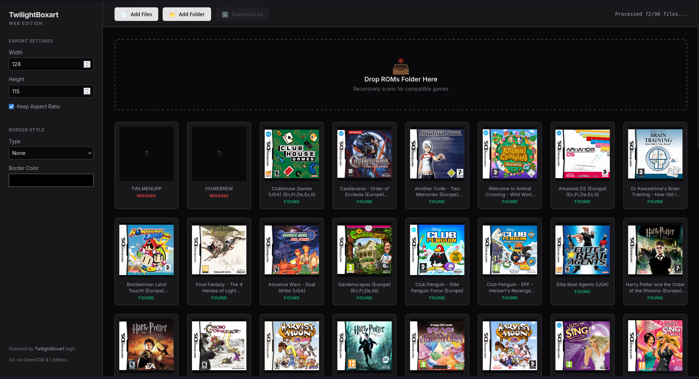

# TwilightBoxart - Web Edition

A modern, high-performance web application to download and process box art for **TWiLight Menu++**. 

This is a complete browser-based rewrite of the original TwilightBoxart C# application. It runs entirely on your device, using modern web technologies to scan your ROMs and generate box art without installing any software.

## ✨ Web Edition Features

-   **🚀 Zero Installation**: Runs directly in your web browser (Chrome, Edge, Firefox).
-   **📂 Drag & Drop Scanning**: Simply drag your entire `roms/` folder onto the page. It recursively finds all compatible games (`.nds`, `.gba`, `.nes`, `.sfc`, etc.).
-   **⚡ High Performance**: Uses **Multi-Threaded Web Workers** to calculate SHA1 hashes and identify games in the background. It won't freeze your UI, even with huge libraries.
-   **🎨 Customization**:
    -   **Borders**: Apply **Nintendo DSi**, **Nintendo 3DS**, or **Simple Line** borders to your covers automatically.
    -   **Resizing**: Set custom dimensions (default 128x115) and toggle Aspect Ratio preservation.
-   **🔒 Privacy Focused**: Your ROMs never leave your computer. All scanning and resizing happens locally in your browser.

## 🎮 Supported Systems

Automatically identifies games using the bundled **No-Intro Database**:

*   Nintendo DS / DSi
*   Game Boy Advance
*   Game Boy / Game Boy Color
*   NES / SNES / Famicom
*   Sega Genesis / Mega Drive / Master System / Game Gear

## 🛠️ How to Use

1.  **Open the Web App**: [Click Here to Run](https://www.justneki.com/TwilightBoxart-GUI/webapp) *(Or open `webapp/index.html` locally)*.
2.  **Add Your Games**: Drag and drop your folder onto the drop zone.
3.  **Configure**: Choose your border style (e.g., "Nintendo DSi") and target size on the sidebar.
4.  **Download**: Click **Download All** to get a `.zip` file containing all your processed box art, ready to put in `_nds/TWiLightMenu/boxart`.

## 🏛️ Legacy C# Application

The original C# desktop application source code is also preserved in this repository (`TwilightBoxart/`). It has been updated to use a local database file instead of the defunct online API, ensuring it remains functional for archival purposes.

##  credits

-   **Original Logic**: [KirovAir](https://github.com/KirovAir)
-   **Box Art Sources**: [GameTDB](https://gametdb.com) and [LibRetro](https://github.com/libretro/libretro-thumbnails).
-   **Database**: [No-Intro](https://datomatic.no-intro.org).
